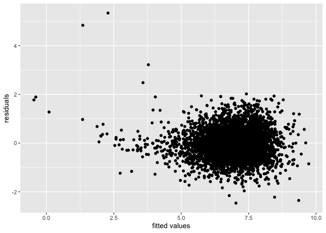
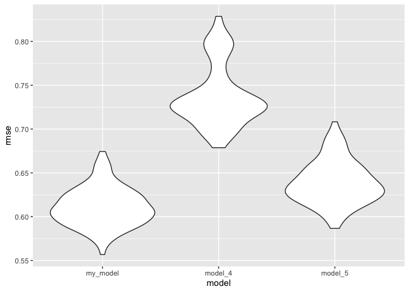
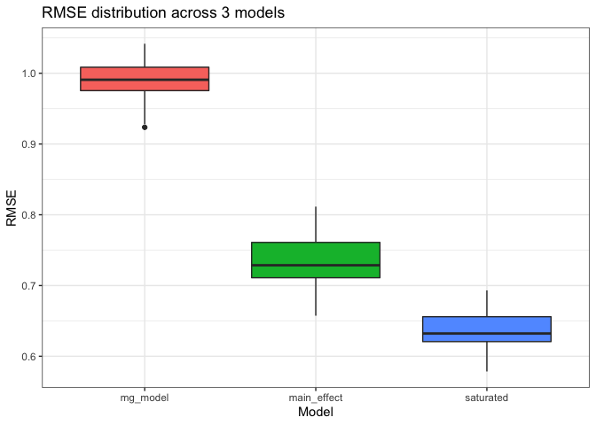
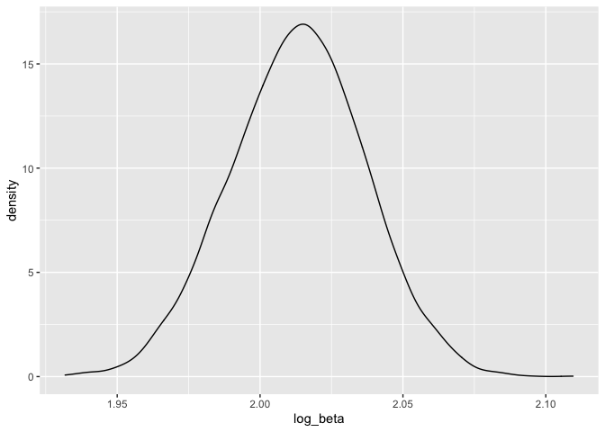
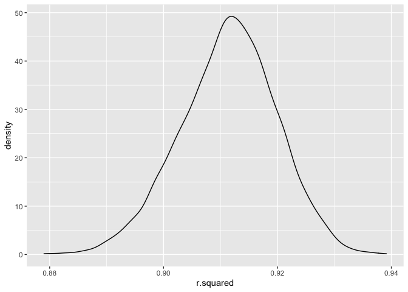

p8105\_hw6\_yz4185.Rmd
================
Yitian Zhang

``` r
library(tidyverse)
library(readr)
library(modelr)
library(patchwork)
```

### Problem 1

##### Clean the data and concert numeric data to factor

``` r
birthweight = 
  read_csv("./data/birthweight.csv") %>% 
  mutate(babysex = factor(babysex),
         frace = factor(frace),
         malform = factor(malform),
         mrace = factor(mrace)) %>% 
  mutate(bwt = bwt*0.00220462)

birthweight %>% skimr::skim()
```

|                                                  |            |
|:-------------------------------------------------|:-----------|
| Name                                             | Piped data |
| Number of rows                                   | 4342       |
| Number of columns                                | 20         |
| \_\_\_\_\_\_\_\_\_\_\_\_\_\_\_\_\_\_\_\_\_\_\_   |            |
| Column type frequency:                           |            |
| factor                                           | 4          |
| numeric                                          | 16         |
| \_\_\_\_\_\_\_\_\_\_\_\_\_\_\_\_\_\_\_\_\_\_\_\_ |            |
| Group variables                                  | None       |

Data summary

**Variable type: factor**

| skim\_variable | n\_missing | complete\_rate | ordered | n\_unique | top\_counts                     |
|:---------------|-----------:|---------------:|:--------|----------:|:--------------------------------|
| babysex        |          0 |              1 | FALSE   |         2 | 1: 2230, 2: 2112                |
| frace          |          0 |              1 | FALSE   |         5 | 1: 2123, 2: 1911, 4: 248, 3: 46 |
| malform        |          0 |              1 | FALSE   |         2 | 0: 4327, 1: 15                  |
| mrace          |          0 |              1 | FALSE   |         4 | 1: 2147, 2: 1909, 4: 243, 3: 43 |

**Variable type: numeric**

| skim\_variable | n\_missing | complete\_rate |   mean |    sd |     p0 |    p25 |    p50 |    p75 |   p100 | hist  |
|:---------------|-----------:|---------------:|-------:|------:|-------:|-------:|-------:|-------:|-------:|:------|
| bhead          |          0 |              1 |  33.65 |  1.62 |  21.00 |  33.00 |  34.00 |  35.00 |  41.00 | ▁▁▆▇▁ |
| blength        |          0 |              1 |  49.75 |  2.72 |  20.00 |  48.00 |  50.00 |  51.00 |  63.00 | ▁▁▁▇▁ |
| bwt            |          0 |              1 |   6.87 |  1.13 |   1.31 |   6.19 |   6.91 |   7.63 |  10.56 | ▁▁▇▇▁ |
| delwt          |          0 |              1 | 145.57 | 22.21 |  86.00 | 131.00 | 143.00 | 157.00 | 334.00 | ▅▇▁▁▁ |
| fincome        |          0 |              1 |  44.11 | 25.98 |   0.00 |  25.00 |  35.00 |  65.00 |  96.00 | ▃▇▅▂▃ |
| gaweeks        |          0 |              1 |  39.43 |  3.15 |  17.70 |  38.30 |  39.90 |  41.10 |  51.30 | ▁▁▂▇▁ |
| menarche       |          0 |              1 |  12.51 |  1.48 |   0.00 |  12.00 |  12.00 |  13.00 |  19.00 | ▁▁▂▇▁ |
| mheight        |          0 |              1 |  63.49 |  2.66 |  48.00 |  62.00 |  63.00 |  65.00 |  77.00 | ▁▁▇▂▁ |
| momage         |          0 |              1 |  20.30 |  3.88 |  12.00 |  18.00 |  20.00 |  22.00 |  44.00 | ▅▇▂▁▁ |
| parity         |          0 |              1 |   0.00 |  0.10 |   0.00 |   0.00 |   0.00 |   0.00 |   6.00 | ▇▁▁▁▁ |
| pnumlbw        |          0 |              1 |   0.00 |  0.00 |   0.00 |   0.00 |   0.00 |   0.00 |   0.00 | ▁▁▇▁▁ |
| pnumsga        |          0 |              1 |   0.00 |  0.00 |   0.00 |   0.00 |   0.00 |   0.00 |   0.00 | ▁▁▇▁▁ |
| ppbmi          |          0 |              1 |  21.57 |  3.18 |  13.07 |  19.53 |  21.03 |  22.91 |  46.10 | ▃▇▁▁▁ |
| ppwt           |          0 |              1 | 123.49 | 20.16 |  70.00 | 110.00 | 120.00 | 134.00 | 287.00 | ▅▇▁▁▁ |
| smoken         |          0 |              1 |   4.15 |  7.41 |   0.00 |   0.00 |   0.00 |   5.00 |  60.00 | ▇▁▁▁▁ |
| wtgain         |          0 |              1 |  22.08 | 10.94 | -46.00 |  15.00 |  22.00 |  28.00 |  89.00 | ▁▁▇▁▁ |

According to the output, there is no missing data.

##### Beacuse of “Parsimony” rule, factor “Parity” will be eliminated at first. Then, I will include all factors in the model and kept thosed statistically significant to find the the fitted model.

``` r
model = lm(bwt ~.,data = birthweight)
summary(model)
```

    ## 
    ## Call:
    ## lm(formula = bwt ~ ., data = birthweight)
    ## 
    ## Residuals:
    ##     Min      1Q  Median      3Q     Max 
    ## -2.4200 -0.4075 -0.0073  0.3816  5.1680 
    ## 
    ## Coefficients: (3 not defined because of singularities)
    ##               Estimate Std. Error t value Pr(>|t|)    
    ## (Intercept) -1.381e+01  1.456e+00  -9.487  < 2e-16 ***
    ## babysex2     6.329e-02  1.866e-02   3.391 0.000702 ***
    ## bhead        2.883e-01  7.611e-03  37.881  < 2e-16 ***
    ## blength      1.652e-01  4.457e-03  37.075  < 2e-16 ***
    ## delwt        9.041e-03  8.704e-04  10.386  < 2e-16 ***
    ## fincome      6.389e-04  3.958e-04   1.614 0.106551    
    ## frace2       3.159e-02  1.017e-01   0.311 0.756168    
    ## frace3       4.682e-02  1.528e-01   0.306 0.759273    
    ## frace4      -1.036e-01  9.850e-02  -1.052 0.292912    
    ## frace8       9.473e-03  1.633e-01   0.058 0.953745    
    ## gaweeks      2.546e-02  3.231e-03   7.882 4.06e-15 ***
    ## malform1     2.153e-02  1.557e-01   0.138 0.890039    
    ## menarche    -7.828e-03  6.383e-03  -1.226 0.220083    
    ## mheight      2.158e-02  2.273e-02   0.949 0.342588    
    ## momage       1.674e-03  2.694e-03   0.621 0.534418    
    ## mrace2      -3.339e-01  1.015e-01  -3.289 0.001014 ** 
    ## mrace3      -2.015e-01  1.586e-01  -1.271 0.203908    
    ## mrace4      -1.245e-01  9.951e-02  -1.251 0.210901    
    ## parity       2.106e-01  8.924e-02   2.360 0.018307 *  
    ## pnumlbw             NA         NA      NA       NA    
    ## pnumsga             NA         NA      NA       NA    
    ## ppbmi        9.598e-03  3.283e-02   0.292 0.770017    
    ## ppwt        -7.653e-03  5.759e-03  -1.329 0.183913    
    ## smoken      -1.070e-02  1.294e-03  -8.269  < 2e-16 ***
    ## wtgain              NA         NA      NA       NA    
    ## ---
    ## Signif. codes:  0 '***' 0.001 '**' 0.01 '*' 0.05 '.' 0.1 ' ' 1
    ## 
    ## Residual standard error: 0.6007 on 4320 degrees of freedom
    ## Multiple R-squared:  0.7183, Adjusted R-squared:  0.717 
    ## F-statistic: 524.6 on 21 and 4320 DF,  p-value: < 2.2e-16

``` r
model_1 = lm(bwt ~ babysex + bhead + blength + delwt + fincome + gaweeks + momage + mrace + parity, data = birthweight)
summary(model_1)
```

    ## 
    ## Call:
    ## lm(formula = bwt ~ babysex + bhead + blength + delwt + fincome + 
    ##     gaweeks + momage + mrace + parity, data = birthweight)
    ## 
    ## Residuals:
    ##     Min      1Q  Median      3Q     Max 
    ## -2.4616 -0.4067 -0.0121  0.3909  5.3471 
    ## 
    ## Coefficients:
    ##               Estimate Std. Error t value Pr(>|t|)    
    ## (Intercept) -1.312e+01  2.218e-01 -59.147  < 2e-16 ***
    ## babysex2     7.040e-02  1.885e-02   3.735  0.00019 ***
    ## bhead        2.939e-01  7.673e-03  38.300  < 2e-16 ***
    ## blength      1.705e-01  4.476e-03  38.093  < 2e-16 ***
    ## delwt        4.717e-03  4.357e-04  10.826  < 2e-16 ***
    ## fincome      8.326e-04  3.978e-04   2.093  0.03641 *  
    ## gaweeks      2.551e-02  3.255e-03   7.838 5.70e-15 ***
    ## momage      -1.005e-03  2.642e-03  -0.381  0.70354    
    ## mrace2      -2.646e-01  2.199e-02 -12.035  < 2e-16 ***
    ## mrace3      -9.459e-02  9.490e-02  -0.997  0.31896    
    ## mrace4      -2.177e-01  4.216e-02  -5.165 2.52e-07 ***
    ## parity       2.261e-01  9.024e-02   2.506  0.01225 *  
    ## ---
    ## Signif. codes:  0 '***' 0.001 '**' 0.01 '*' 0.05 '.' 0.1 ' ' 1
    ## 
    ## Residual standard error: 0.6079 on 4330 degrees of freedom
    ## Multiple R-squared:  0.7108, Adjusted R-squared:  0.7101 
    ## F-statistic: 967.6 on 11 and 4330 DF,  p-value: < 2.2e-16

``` r
model_2 = lm(bwt ~ babysex + bhead + blength + delwt + fincome + gaweeks + mrace + parity, data = birthweight)
summary(model_2)
```

    ## 
    ## Call:
    ## lm(formula = bwt ~ babysex + bhead + blength + delwt + fincome + 
    ##     gaweeks + mrace + parity, data = birthweight)
    ## 
    ## Residuals:
    ##     Min      1Q  Median      3Q     Max 
    ## -2.4639 -0.4075 -0.0126  0.3919  5.3470 
    ## 
    ## Coefficients:
    ##               Estimate Std. Error t value Pr(>|t|)    
    ## (Intercept) -1.314e+01  2.173e-01 -60.466  < 2e-16 ***
    ## babysex2     7.060e-02  1.884e-02   3.748 0.000181 ***
    ## bhead        2.938e-01  7.672e-03  38.302  < 2e-16 ***
    ## blength      1.705e-01  4.475e-03  38.115  < 2e-16 ***
    ## delwt        4.703e-03  4.342e-04  10.832  < 2e-16 ***
    ## fincome      7.996e-04  3.882e-04   2.060 0.039491 *  
    ## gaweeks      2.546e-02  3.251e-03   7.830 6.09e-15 ***
    ## mrace2      -2.626e-01  2.133e-02 -12.311  < 2e-16 ***
    ## mrace3      -9.903e-02  9.417e-02  -1.052 0.293044    
    ## mrace4      -2.168e-01  4.208e-02  -5.152 2.70e-07 ***
    ## parity       2.237e-01  9.001e-02   2.485 0.012981 *  
    ## ---
    ## Signif. codes:  0 '***' 0.001 '**' 0.01 '*' 0.05 '.' 0.1 ' ' 1
    ## 
    ## Residual standard error: 0.6079 on 4331 degrees of freedom
    ## Multiple R-squared:  0.7108, Adjusted R-squared:  0.7102 
    ## F-statistic:  1065 on 10 and 4331 DF,  p-value: < 2.2e-16

``` r
model_3 = lm(bwt ~ babysex + bhead + blength + delwt + fincome + gaweeks + mrace, data = birthweight)
summary(model_3)
```

    ## 
    ## Call:
    ## lm(formula = bwt ~ babysex + bhead + blength + delwt + fincome + 
    ##     gaweeks + mrace, data = birthweight)
    ## 
    ## Residuals:
    ##     Min      1Q  Median      3Q     Max 
    ## -2.4652 -0.4084 -0.0131  0.3915  5.3407 
    ## 
    ## Coefficients:
    ##               Estimate Std. Error t value Pr(>|t|)    
    ## (Intercept) -1.312e+01  2.172e-01 -60.380  < 2e-16 ***
    ## babysex2     7.188e-02  1.884e-02   3.814 0.000138 ***
    ## bhead        2.942e-01  7.675e-03  38.338  < 2e-16 ***
    ## blength      1.704e-01  4.477e-03  38.062  < 2e-16 ***
    ## delwt        4.707e-03  4.344e-04  10.836  < 2e-16 ***
    ## fincome      7.783e-04  3.884e-04   2.004 0.045131 *  
    ## gaweeks      2.484e-02  3.244e-03   7.658 2.32e-14 ***
    ## mrace2      -2.632e-01  2.134e-02 -12.334  < 2e-16 ***
    ## mrace3      -9.942e-02  9.423e-02  -1.055 0.291446    
    ## mrace4      -2.181e-01  4.210e-02  -5.182 2.30e-07 ***
    ## ---
    ## Signif. codes:  0 '***' 0.001 '**' 0.01 '*' 0.05 '.' 0.1 ' ' 1
    ## 
    ## Residual standard error: 0.6082 on 4332 degrees of freedom
    ## Multiple R-squared:  0.7104, Adjusted R-squared:  0.7098 
    ## F-statistic:  1181 on 9 and 4332 DF,  p-value: < 2.2e-16

##### Make the plot, the model comparisons, and the cross-validation by using modelr

``` r
birthweight %>%
  modelr::add_residuals(model_3) %>%
  modelr::add_predictions(model_3) %>%
  ggplot(aes(x = pred, y = resid)) +
  geom_point() +
  labs(x = "fitted values", y = "residuals")
```

<!-- -->

``` r
cv_df =
  crossv_mc(birthweight, 100)  %>% 
  mutate(
    train = map(train, as_tibble),
    test = map(test, as_tibble),
    my_mod  = map(train, ~lm(bwt ~ babysex + bhead + blength + delwt + fincome + gaweeks + mrace, data = .x)),
    model_4  = map(train, ~lm(bwt ~ blength + gaweeks, data = .x)),
    model_5  = map(train, ~lm(bwt ~ bhead + blength + babysex + bhead*blength + bhead*babysex + blength*babysex + bhead*blength*babysex, data = .x))) %>%
  mutate(
    rmse_my_model = map2_dbl(my_mod, test, ~rmse(model = .x, data = .y)),
    rmse_model_4 = map2_dbl(model_4, test, ~rmse(model = .x, data = .y)),
    rmse_model_5 = map2_dbl(model_5, test, ~rmse(model = .x, data = .y)))
cv_df %>% 
  select(starts_with("rmse")) %>% 
  pivot_longer(
    everything(),
    names_to = "model", 
    values_to = "rmse",
    names_prefix = "rmse_") %>% 
  mutate(model = fct_inorder(model)) %>% 
  ggplot(aes(x = model, y = rmse)) + geom_violin()
```

<!-- -->

``` r
cv_df =
  crossv_mc(birthweight, 100)
cv_df = 
cv_df %>%
  mutate(
    mg_model = map(train, ~lm(bwt ~ gaweeks+mrace+ppbmi+fincome+momage, data = .x)),
    main_effect = map(train, ~lm(bwt ~ blength + gaweeks, data = .x)),
    saturated = map(train, ~lm(bwt ~ bhead*blength*babysex, data = .x))
  ) %>%
  mutate(
    rmse_mg_model = map2_dbl(mg_model, test, ~rmse(model = .x, data = .y)),
    rmse_main_effect = map2_dbl(main_effect, test, ~rmse(model = .x, data = .y)),
    rmse_saturated = map2_dbl(saturated, test, ~rmse(model = .x, data = .y))
  )
```

##### Look at distribution of RMSEs to see which model is best

``` r
cv_df %>% 
  select(starts_with("rmse")) %>% 
  pivot_longer(
    everything(),
    names_to = "model", 
    values_to = "rmse",
    names_prefix = "rmse_") %>% 
  mutate(model = fct_inorder(model)) %>% 
  ggplot(aes(x = model, y = rmse)) +
  geom_boxplot(aes(fill=model))+
  theme_bw()+
  labs(
    x = "Model",
    y = "RMSE",
    title = "RMSE distribution across 3 models"
  )+
  theme(legend.position = "none")
```

<!-- --> According to the
output, saturated model fits the best.

### Problem 2

##### Load the noaa data

``` r
weather_df = 
  rnoaa::meteo_pull_monitors(
    c("USW00094728"),
    var = c("PRCP", "TMIN", "TMAX"), 
    date_min = "2017-01-01",
    date_max = "2017-12-31") %>%
  mutate(
    name = recode(id, USW00094728 = "CentralPark_NY"),
    tmin = tmin / 10,
    tmax = tmax / 10) %>%
  select(name,id, everything())
```

    ## Registered S3 method overwritten by 'hoardr':
    ##   method           from
    ##   print.cache_info httr

    ## using cached file: ~/Library/Caches/R/noaa_ghcnd/USW00094728.dly

    ## date created (size, mb): 2021-12-04 01:15:51 (7.616)

    ## file min/max dates: 1869-01-01 / 2021-12-31

##### Use 5000 bootstrap samples and for sample produce estimates of r hat sqaure and log(*β̂*<sub>0</sub> \* *β̂*<sub>1</sub>)

``` r
weather_bootstrap_results = 
  weather_df %>% 
  select(tmax, tmin) %>% 
  bootstrap(n = 5000, id = "strap_number") %>%
  mutate(
    models = map(.x = strap, ~lm(tmax ~ tmin, data = .x)),
    results_coeff = map(models, broom::tidy),
    results_rsquare = map(models, broom::glance)
  ) %>% 
  select(strap_number, results_coeff, results_rsquare) %>% 
  unnest(results_coeff) %>% 
  select(strap_number,term, estimate, results_rsquare) %>% 
  unnest(results_rsquare) %>% 
  select(strap_number, term, estimate, r.squared)
```

``` r
beta0_df = 
  weather_bootstrap_results %>% 
  filter(term == "(Intercept)") %>% 
  select(strap_number, estimate) %>% 
  rename(beta0 = estimate)


beta1_df = 
  weather_bootstrap_results %>% 
  filter(term == "tmin") %>%
  select(strap_number,estimate) %>% 
  rename(beta1 = estimate)

betas_df = 
  inner_join(beta0_df, beta1_df, by = "strap_number") %>% 
  mutate(log_beta = log(beta0*beta1))

betas_df %>% 
  ggplot(aes(log_beta)) +
  geom_density()
```

<!-- -->

The distribution of log(*β̂*<sub>0</sub> \* *β̂*<sub>1</sub>) looks like a
good distribution overall.

##### Identify the 2.5% and 97.5% quantiles to provide a 95% confidence interval for log(*β̂*<sub>0</sub> \* *β̂*<sub>1</sub>)

``` r
quantile(betas_df$log_beta, c(.025, 0.975)) 
```

    ##     2.5%    97.5% 
    ## 1.966251 2.059638

As a result, the 95% confidence interal for log(*β̂*<sub>0</sub> \*
*β̂*<sub>1</sub>) is (1.96, 2.05).

##### Appy the same proccess for r hat sqaure

``` r
rsquare_df = 
  weather_bootstrap_results %>% 
  select(strap_number, r.squared) %>% 
  distinct(strap_number, .keep_all = TRUE)
rsquare_df %>% 
  ggplot(aes(r.squared)) +
  geom_density()
```

<!-- -->

The distribution of r hat square looks like a good normal distribution
overall but slightly left-skewd.

``` r
quantile(rsquare_df$r.squared, c(.025, 0.975)) 
```

    ##     2.5%    97.5% 
    ## 0.893924 0.927172

According to the output, the 95% confidence interal for r hat square is
(0.89, 0.92).
